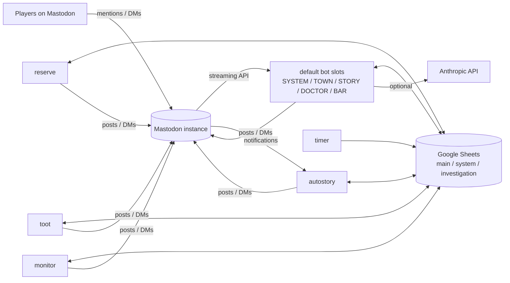

# shinarmont-bot

> A monorepo of Python Mastodon bots that run a Korean role-play community game ("Shinarmont"), with Google Sheets as the game master's control panel and database.

Players interact with the game by mentioning or DMing bot accounts with bracketed commands (for example `[출석]`, `[조사/장소]`, `[블랙잭/10]`). The bots read and write game state in Google Sheets, so game masters can run the event from a spreadsheet without touching code.

## Bots

| Directory | Bot | What it does |
|---|---|---|
| [`default/`](default/) | Command bot (multi-slot) | The main game engine. One codebase runs up to five bot accounts at once (`@SYSTEM`, `@TOWN`, `@STORY`, `@DOCTOR`, `@BAR`), each exposing a filtered set of commands: attendance and shop, location investigation and tracking, secret talks, accusations and votes, an AI-driven infirmary doctor, and casino games (slots, craps, blackjack). Also sends the GM a nightly digest DM. See [`default/README.md`](default/README.md). |
| [`autostory/`](autostory/) | Story script bot | Posts story scripts from a spreadsheet, line by line, across several narrator accounts when a GM triggers a worksheet by DM. See [`autostory/README.md`](autostory/README.md). |
| [`reserve/`](reserve/) | Scheduled post bot | Syncs a sheet of scheduled toots every 20 minutes, caches it locally, and publishes each toot at its scheduled minute. |
| [`toot/`](toot/) | Activity reward bot | Periodically counts each player's toots through the Mastodon API and pays currency rewards into the shop sheet per N toots. |
| [`monitor/`](monitor/) | Stat monitor | Every hour on the hour, checks the `관리` (management) sheet for low health/sanity values and sends each affected character a one-time warning DM. |
| [`timer/`](timer/) | Daily reset job | At 00:00 resets the daily counter columns (for example `추적`, `조사`) to 0 and clears the attendance column in the management sheet. |

## Features

- **Multi-account command bot**: `default/bot_manager.py` launches one process per `BOTn_*` slot, each with its own token, command filter, allowed visibility and log file, and restarts crashed slots.
- **Sheet-driven game data**: shops, items, investigation locations, fortunes, help text and custom commands all live in worksheets and are cached with TTLs to stay within Google Sheets API quotas.
- **Credential pool**: Sheets access is spread across several service accounts per purpose (`CREDENTIAL_MAIN`, `CREDENTIAL_SYSTEM`, `CREDENTIAL_INVESTIGATION`) and fails over to another account on a 429 or 403.
- **AI doctor and perception distortion**: the `@DOCTOR` slot uses the Anthropic API to role-play a physician with persistent visit history, and low-sanity characters get masked or distorted investigation results. Both fall back to rule-based behavior when AI is disabled.
- **GM daily digest**: at a configured time the bot gathers the day's actions and DMs the GM a rumor brief, with mention defanging so quoted `@handles` never notify players.
- **Concurrency safety**: per-user locks, rate limiting and atomic JSON state files (`state/<slot>/*.json`) survive restarts.

## Tech Stack

| Area | Tools |
|---|---|
| Language | Python 3 |
| Mastodon | [Mastodon.py](https://github.com/halcy/Mastodon.py) (streaming API and REST) |
| Data store | Google Sheets via `gspread` and `google-api-python-client`; Google Drive for story images |
| Scheduling | APScheduler, `schedule` |
| AI | Anthropic Python SDK (optional, `default/` only) |
| Config | `python-dotenv` (`.env` per bot) |
| Tests | `pytest` / `unittest` |

## Architecture



Each bot is an independent Python project with its own `requirements.txt`, `.env` and service-account file, and they are deployed as separate processes. They share one Mastodon instance and the same game spreadsheets, so they coordinate through the sheets instead of calling each other: for example `timer` clears the attendance column that `default`'s `[출석]` command checks.

Inside `default/`, a status flows through `handlers/stream_handler.py` (visibility checks, DM chat handling, reply-thread routing) to `handlers/command_router.py`, which looks the keyword up in `commands/registry.py` and runs a `BaseCommand` subclass. Shared helpers live in `utils/` (sheets access, locks, caching, game state, AI client).

## Getting Started

### Prerequisites

- Python 3.8 or newer
- A Mastodon account (access token) for each bot account
- A Google Cloud service account with the Sheets API (and Drive API for `autostory`/`reserve`) enabled, shared on the target spreadsheets

### Installation

Each bot is installed and run from its own directory:

```bash
git clone https://github.com/eden-chang/shinarmont-bot.git
cd shinarmont-bot/default        # or autostory, reserve, toot, monitor, timer
python -m venv .venv
source .venv/bin/activate        # Windows: .venv\Scripts\activate
pip install -r requirements.txt
```

The top-level `requirements.txt` is a union of every bot's dependencies. Note that `toot` and `monitor` were written against gspread 5.x while `default` uses gspread 6.x.

### Configuration

1. Copy the bot's example env file to `.env` and fill it in:

   | Bot | Template |
   |---|---|
   | `default` | `.env.multibot.example` (generic multi-bot) or `.env.shinarmont.example` (the five Shinarmont slots) |
   | `autostory`, `reserve`, `toot`, `monitor`, `timer` | `.env.example` |

2. Put the Google service-account key where the bot expects it (these paths are git-ignored):

   | Bot | Path |
   |---|---|
   | `default` | `credentials/<name>_credentials.json` for the credential pool, with `credentials.json` as a fallback (`GOOGLE_CREDENTIALS_PATH`) |
   | others | `credentials.json` in the bot directory (`timer` also reads `GOOGLE_CREDENTIALS_PATH`) |

3. For `default`, run the setup checker before the first launch:

   ```bash
   python tools/check_setup.py
   ```

## Environment Variables

Each example file lists every key with comments. The most important ones:

| Variable | Bot | Description | Example |
|---|---|---|---|
| `MASTODON_API_BASE_URL` | default, reserve, toot, monitor | Instance URL (`autostory` uses `MASTODON_INSTANCE_URL`) | `https://your.mastodon.instance` |
| `BOTn_ACCESS_TOKEN`, `BOTn_NAME`, `BOTn_COMMAND_FILTER` | default | Per-slot token, display name and allowed commands | `BOT1_NAME=SYSTEM` |
| `ENABLE_MULTI_BOT` | default | Run all enabled slots through the bot manager | `True` |
| `SHEET_ID`, `SYSTEM_SHEET_ID`, `INVESTIGATION_SHEET_ID` | default | Spreadsheet keys | `1AbC...` |
| `CREDENTIAL_MAIN`, `CREDENTIAL_SYSTEM`, `CREDENTIAL_INVESTIGATION` | default | Service-account names per purpose, in priority order | `genesis,oblivion` |
| `AI_ENABLED`, `ANTHROPIC_API_KEY` | default | Enable the AI doctor and distortion | `True`, `sk-ant-...` |
| `MASTODON_ACCOUNTS`, `<NAME>_ACCESS_TOKEN` | autostory, reserve | Narrator account names and one token per account | `NOTICE,SYSTEM,STORY` |
| `GOOGLE_SHEETS_ID` | autostory, reserve | Source spreadsheet key | `1AbC...` |
| `TOOT_SHEET_ID`, `SHOP_SHEET_ID`, `TOOTS_PER_REWARD`, `REWARD_AMOUNT` | toot | Sheets to read/write and the reward rate | `100`, `1` |
| `MANAGE_SHEET_ID`, `SANITY_SHEET_ID` | monitor | Sheets with the stats and warning texts | `1AbC...` |
| `BOT_SPREADSHEET_ID`, `RESET_COLUMN`, `BLANK_COLUMN` | timer | Sheet and columns to reset at midnight | `추적,조사`, `출석` |

`default/docs/references/ENV_VARS.md` documents every variable of the command bot with types and defaults.

## Usage

```bash
# default: launches every enabled BOTn slot when ENABLE_MULTI_BOT=True
cd default && python main.py

# run a single slot
cd default && python main.py --bot-id BOT2

# other bots
cd autostory && python main.py
cd reserve && python main.py
cd toot && python main.py
cd monitor && python main.py      # or ./start_bot.sh on a VM
cd timer && python main.py
```

Players then send commands to the bot accounts, for example `[출석]` to `@SYSTEM`, `[진입/장소명]` then `[조사/포인트]` to `@TOWN`, or `[의무실 방문]` to `@DOCTOR`. Command lists per slot come from `BOTn_COMMAND_FILTER`, and `default/docs/명령어_개요.md` describes each command.

## Testing

```bash
cd default && python -m pytest       # command bot unit tests
cd autostory && python -m pytest     # DM chat handling tests
```

Tests use fakes for Mastodon, Sheets and the Anthropic client, so no network access or credentials are needed. Tests that need the private resident roster (`default/data/주민_명부.md`, not committed) are skipped when it is missing.

## Project Structure

```
shinarmont-bot/
├── default/            # multi-slot command bot (main game engine)
│   ├── main.py         # entry point, routes to bot_manager in multi-bot mode
│   ├── bot_manager.py  # spawns and supervises one process per BOTn slot
│   ├── commands/       # BaseCommand subclasses grouped by feature
│   ├── handlers/       # streaming listener and command router
│   ├── utils/          # sheets, locks, cache, game state, AI client, digest
│   ├── config/         # settings loaded from .env
│   ├── tools/          # setup checker and maintenance scripts
│   ├── docs/           # design docs and API references (Korean)
│   └── tests/
├── autostory/          # story script bot (config/, core/, utils/, tests/)
├── reserve/            # scheduled post bot (config/, core/, utils/)
├── toot/               # activity reward bot (config/, core/, utils/, tests/)
├── monitor/            # hourly stat warning bot (single main.py)
├── timer/              # midnight counter reset job (single main.py)
└── requirements.txt    # union of all bots' dependencies
```
